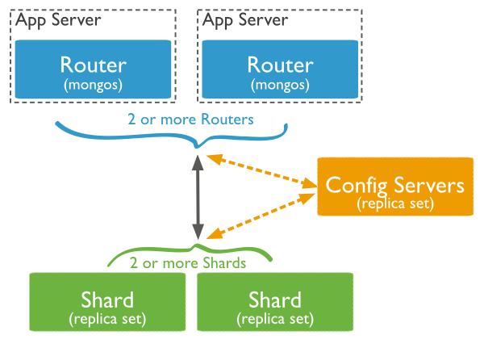

## 部署架构

EAD的硬件部署方案可以非常灵活，支持传统主机部署、私有云部署和公有云部署等多种硬件部署架构和方案。不管是哪一种部署方式，对服务器配置和性能的要求基本是相同的。

因此，EAD的部署架构主要是根据用户访问的规模和对性能和可靠性的要求，分为单服务器部署架构和分布式部署架构两种方式。

### 1. 集中式部署架构
集中式部署，又叫单例部署，是EAD最常见的部署方式，部署简单，对硬件要求低，只需要最多三台服务器就可以完成部署。

集中式部署方式如下图所示：

我们选用MySQL作为关系数据库存储，部署在一台服务器上，选用MongoDB作为文档数据服务器，EAD的核心应用和Tomcat部署在一台专用的Web服务器上。如果服务器资源紧张，这三个服务器也可以公用。

### 2. 分布式部署架构

分布式部署多用在大型企业应用领域，适用于数据量大，用户数多，并发访问压力大的业务场景。分布式部署方式如下图所示：

数据库存储层采用集群的方式来保证数据库服务的高可用性，Web访问层采用Nginx做负载均衡，通过反向代理的方式挂载多台Tomcat服务器对外提供Web服务。当然，也可以采用F5等通过硬件来做负载均衡，提高Web服务器性能的方式。

#### MySQL集群搭建

[官方文档 from Orcale.com](https://docs.oracle.com/cd/E19078-01/mysql/mysql-refman-5.0/mysql-cluster.html)

MySQL Cluster是一个高性能、可扩展、集群化数据库产品。MySQL Cluster是一个基于**NDB Cluster**存储引擎的完整分布式数据库系统，采用无共享的数据存储技术，实时同步且支持快速故障切换、事务。NDB是一种in-memory的存储引擎，它具有可用性高和数据一致性好的特点。

MySQL Cluster可由多台服务器组成的、同时对外提供数据管理服务的分布式集群系统。通过合理的配置，可以将服务请求在多台物理机上分发实现**负载均衡**；同时内部实现了**冗余机制**，在部分服务器宕机的情况下，整个集群对外提供的服务不受影响，从而能达到**99.999%**以上的高可用性。

如上图所示，MySQL Cluster分为三类节点：

**数据节点（Data Nodes）：** 用于存储集群的数据。实现底层数据存储的功能，保存Cluster的数据。每一个NDB节点保存完整数据的一部分（或者一份完整的数据，视节点数目和配置而定），在MySQL Cluster 里面叫做一个fragment。而每一个fragment，正常情况来讲都会在其他的主机上面有一份（或者多份）完全相同的镜像存在。这些都是通过配置来完成的，所以只要配置得当，MySQL Cluster 在存储层**不会出现单点**的问题。数据节点是用命令`ndbd`启动的。

**SQL节点（SQL Nodes）：** 向外提供一个标准的SQL语言编程接口。SQL节点负责向数据节点传送访问请求，具体集群过程以及数据库底层均对外透明。

SQL节点提供用户SQL指令请求，解析、连接管理，query优化和响应、cache管理等、数据merge、sort，裁剪等功能，当SQL节点启动时，将向管理节点同步架构信息，用以数据查询路由。SQL节点作为查询入口，需要消耗大量cpu及内存资源，可使用分布式管理节点，并在SQL节点外封装一层请求分发及HA控制机制可解决单点及性能问题，其提供了线性扩展功能。SQL节点是使用命令`mysqld -ndbcluster`启动的，或将`ndbcluster`添加到“my.cnf”后使用“mysqld”启动。

**管理节点（NDB Management Server）：** 负责整个Cluster 集群中各个节点的管理工作，包括集群的配置，启动关闭各节点，以及实施数据的备份恢复等。管理节点会获取整个Cluster 环境中各节点的状态和错误信息，并且将各Cluster集群中各个节点的信息反馈给整个集群中其他的所有节点。通常只需配置一个管理节点；然而为了排除单点故障需要，有可能的话，尽量增加管理节点的数量。MGM节点是用命令`ndb_mgm`启动的。

**Mysql集群软件：** mysql-cluster-gpl-7.2.8-linux2.6-x86_64.tar.gz [下载地址](http://mysql.mirror.kangaroot.net/Downloads/)

[详细配置步骤 from SegmentFault](https://segmentfault.com/a/1190000003715950)

#### MongoDB集群搭建
MongoDB在处理非结构化数据时有以下优势：

**大数据量**，可以通过廉价服务器存储大量的数据，轻松摆脱传统mysql单表存储量级限制。

**高扩展性**，MongoDB去掉了关系数据库的关系型特性，很容易横向扩展，摆脱了以往老是纵向扩展的诟病。

**高性能**，MongoDB通过简单的key-value方式获取数据，非常快速。还有MongoDB的Cache是记录级的，是一种细粒度的Cache，所以MongoDB在这个层面上来说就要性能高很多。

**灵活的数据模型**，MongoDB无需事先为要存储的数据建立字段，随时可以存储自定义的数据格式。而在关系数据库里，增删字段是一件非常麻烦的事情。如果是非常大数据量的表，增加字段简直就是一个噩梦。

**高可用**，MongoDB在不太影响性能的情况，就可以方便的实现高可用的架构。MongoDB可以通过mongos、mongo分片就可以快速配置出高可用配置。

MongoDB也可以通过集群的方式实现高可用，MongoDB的集群配置包括以下组件，如图所示：
[资料来源：mongodb.org](https://docs.mongodb.org/manual/core/sharded-cluster-architectures-production/#production-cluster-architecture)

**配置服务器Config Servers：** 在最新的MongoDB3.2中，分片集群的配置服务器可以部署为副本集。副本集的配置服务器必须运行WiredTiger 存储引擎。单一的分片集群必须独占使用其配置服务器。如果您有多个分片集群，每个集群必须拥有专有的的副本集配置服务器。

**两个或更多副本集作为分片服务器：** 这些副本集是碎片。随后会详细介绍如何创建副本集。

**一个或多个查询路由器(mongos)：** mongos实例是为集群的路由器。通常情况下，每个应用服务器需要部署一个mongos实例。
也可以部署一组的mongos实例并在应用和mongos之间采用代理/负载均衡器。在这些部署中，您必须配置负载平衡器客户端的相似性，以便从单个客户端的每个连接都能指向相同的mongos。因为游标和其他资源是特定于单个mongos实例的，每个客户端只能与同一个mongos实例进行交互。