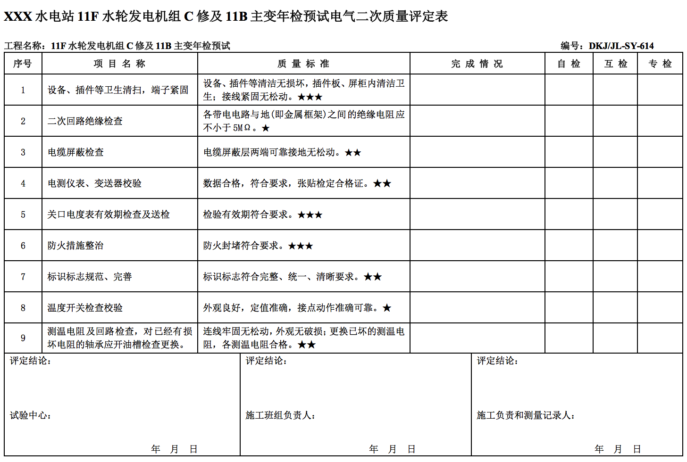
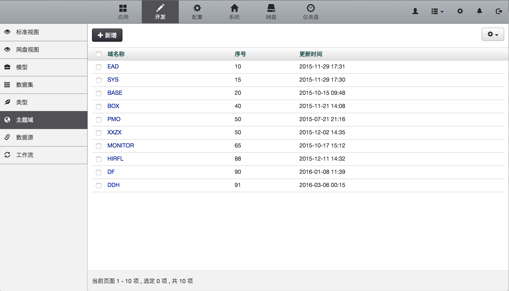

#典型用例 - 表单数据录入应用
##应用场景描述
某电力集团下属的检修安装公司每年有大量手工的检修质量检查的结果单据要收集、统计、分析和归档，原来都是靠人工收集纸质或者电子版的质量检查评定表，然后再人工汇总、统计和分析，费时费力，还容易出错，统计结果也无法及时获得。因此急需一个质检评定表的录入系统，实现质检评定结果的数据化和系统化。

##应用场景特点
- 模型设计
- 父子表嵌套
- 新建应用
- 资源与授权

##业务需求
###一个原始数据表 

接下来我们就要使用EAD开发一个录入这类表格数据的小系统。

##EAD 用例实现
###Step1. 模型设计
通过分析原始表格的数据，我们需要建立两个模型：

- 评定表模型，一个类似的质量评定表对应该模型的一个实例；
- 评定项模型，一个质量评定项目对应该模型的一个实例。
- 视图动作：属性列表定义了视图动作能够影响的范围，比如同一个报表中不同的角色需要不同的权限来编辑同一个数据表中的不同字段

在EAD中有两种方式可以创建模型，一种是手工创建，一种是通过Excel模板创建。一般我们使用Excel模板来创建模型，这样效率更高。

####1 首先登录开发者中心，创建一个我们这次应用的主题域
菜单栏导航到`开发`-->`主题域`-->点击`新增`按钮：

录入主题域名称、描述和说明，并设置改主题域在主题域列表中的排序序号：

####2 下载模板并编辑

